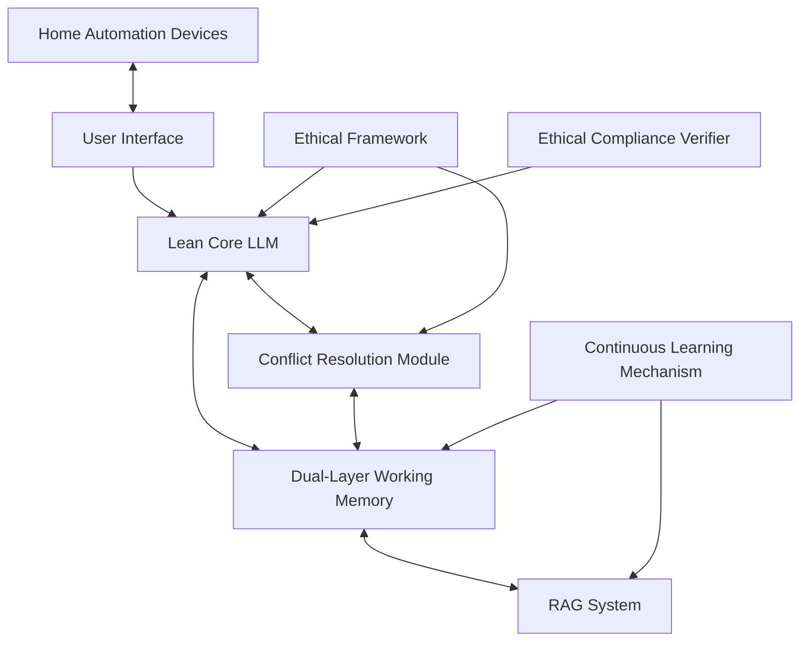

# Comprehensive Proposal: Advanced LLM-RAG System for Home Automation and Personal AI

## Table of Contents

1. Executive Summary
2. System Architecture Overview
3. Core Components
   3.1 Lean Core LLM
   3.2 Expansive RAG System
   3.3 Dual-Layer Working Memory
   3.4 Ethical Framework and Alignment
   3.5 Conflict Resolution and Bias Mitigation Module
   3.6 Continuous Learning Mechanism
4. Detailed Component Breakdown
5. Implementation Strategy
6. Hardware Considerations
7. Ethical Considerations and Alignment
8. Advantages of the Proposed System
9. Challenges and Considerations
10. Next Steps and Timeline
11. Conclusion

## 1. Executive Summary

This proposal outlines an advanced Retrieval-Augmented Generation (RAG) system designed for home automation and personal AI assistance. The system leverages a lean Large Language Model (LLM) core, focusing on basic English language skills and database interaction, with most knowledge and skills stored in an expansive RAG system. Key features include a dual-layer working memory system, sophisticated conflict resolution mechanisms, and a robust ethical framework. The system is designed to be privacy-focused, adaptable, and capable of continuous learning while maintaining strong ethical alignment.

## 2. System Architecture Overview

The system consists of the following core components:

1. Lean Core LLM
2. Expansive RAG System
3. Dual-Layer Working Memory
4. Ethical Framework and Alignment Module
5. Conflict Resolution and Bias Mitigation Module
6. Continuous Learning Mechanism

### Architecture Diagram



## 3. Core Components

### 3.1 Lean Core LLM

- Focus: Basic English language understanding and database query formulation
- Size: Targeting 1-2 billion parameters
- Key Capability: Efficient integration with RAG and working memory systems

### 3.2 Expansive RAG System

- Primary knowledge store for factual, procedural, and episodic information
- Utilizes Neo4j for graph structure and a vector store for semantic search
- Implements STaR-inspired learning for continuous knowledge acquisition

### 3.3 Dual-Layer Working Memory

#### a. RAM-based Primary Layer

- Fast-access storage for immediate context and frequently used information
- Limited by defined context length (e.g., 1000 items)

#### b. Storage-based Secondary Layer (Cache)

- Larger capacity storage on fast SSD/NVMe
- Stores less immediate or less frequently accessed information
- Implements a caching mechanism for efficient data movement between layers

### 3.4 Ethical Framework and Alignment

- Core set of immutable ethical principles hardcoded into the LLM
- Contextual application of ethical principles through RAG and working memory
- Continuous ethical reasoning and decision-making processes

### 3.5 Conflict Resolution and Bias Mitigation Module

- Detects inconsistencies between LLM context and working memory
- Implements multiple resolution strategies:
  - Human guidance seeking
  - Conflict storage for future resolution
  - Evidence-based automated resolution
- Incorporates bias detection and mitigation techniques
- Utilizes a structured decision-making framework

### 3.6 Continuous Learning Mechanism

- Captures and processes relevant interactions
- Adds new knowledge directly to the RAG system
- Implements a feedback loop for refining conflict resolution strategies

## 4. Detailed Component Breakdown

### 4.1 Lean Core LLM

The core LLM is designed to be lightweight yet capable, focusing on:

- Basic English language processing
- Query generation for database interactions
- Integration with the RAG system and working memory

Implementation:

```python
class LeanCoreLLM:
    def __init__(self, model_path, ethical_framework):
        self.model = load_model(model_path)
        self.ethical_framework = ethical_framework

    def process_input(self, user_input, working_memory, rag_system):
        # Process input, generate queries, and produce output
        # while adhering to ethical framework
        pass

    def generate_query(self, intent):
        # Generate database query based on intent
        pass

    def ethical_check(self, output):
        # Verify output against ethical framework
        pass
```

### 4.2 Expansive RAG System

The RAG system combines Neo4j for graph structure and a vector store for semantic search:

```python
class RAGSystem:
    def __init__(self, neo4j_connection, vector_store):
        self.graph_db = neo4j_connection
        self.vector_store = vector_store

    def query(self, user_intent):
        # Combine graph and vector queries for comprehensive retrieval
        graph_results = self.graph_db.query(user_intent)
        vector_results = self.vector_store.query(user_intent)
        return self.merge_results(graph_results, vector_results)

    def update_knowledge(self, new_information):
        # Add new information to both graph and vector stores
        self.graph_db.update(new_information)
        self.vector_store.update(new_information)

    def merge_results(self, graph_results, vector_results):
        # Intelligent merging of results from both sources
        pass
```

### 4.3 Dual-Layer Working Memory

Implementation of the dual-layer working memory system:

```python
class DualLayerWorkingMemory:
    def __init__(self, ram_capacity=1000, cache_file="wm_cache.json"):
        self.ram_storage = OrderedDict()
        self.ram_capacity = ram_capacity
        self.cache_file = cache_file
        self.load_cache()

    def load_cache(self):
        if os.path.exists(self.cache_file):
            with open(self.cache_file, 'r') as f:
                self.file_storage = json.load(f)
        else:
            self.file_storage = {}

    def save_cache(self):
        with open(self.cache_file, 'w') as f:
            json.dump(self.file_storage, f)

    def write(self, key, value):
        if len(self.ram_storage) >= self.ram_capacity:
            # Move least recently used item to file storage
            old_key, old_value = self.ram_storage.popitem(last=False)
            self.file_storage[old_key] = old_value
            self.save_cache()

        self.ram_storage[key] = value
        self.ram_storage.move_to_end(key)  # Mark as most recently used

    def read(self, key):
        if key in self.ram_storage:
            self.ram_storage.move_to_end(key)  # Mark as most recently used
            return self.ram_storage[key]
        elif key in self.file_storage:
            value = self.file_storage.pop(key)
            self.write(key, value)  # Move to RAM
            return value
        return None

    def clear(self):
        self.ram_storage.clear()
        self.file_storage.clear()
        self.save_cache()
```

### 4.4 Ethical Framework and Alignment

Implementation of the core ethical framework:

```python
class EthicalFramework:
    def __init__(self, core_principles):
        self.core_principles = core_principles

    def evaluate_action(self, proposed_action):
        for principle in self.core_principles:
            if not principle.is_satisfied(proposed_action):
                return False, f"Violates principle: {principle.description}"
        return True, "Action is ethically sound"

    def apply_ethical_reasoning(self, situation, possible_actions):
        ethical_actions = []
        for action in possible_actions:
            is_ethical, reason = self.evaluate_action(action)
            if is_ethical:
                ethical_actions.append(action)
        return ethical_actions
```

### 4.5 Conflict Resolution and Bias Mitigation Module

```python
class ConflictResolver:
    def __init__(self, llm, rag_system, working_memory, ethical_framework):
        self.llm = llm
        self.rag = rag_system
        self.memory = working_memory
        self.ethical_framework = ethical_framework

    def resolve_conflict(self, conflicting_data):
        # Implement conflict resolution strategies
        pass

    def detect_bias(self, decision):
        # Implement bias detection
        pass

    def mitigate_bias(self, biased_decision):
        # Implement bias mitigation strategies
        pass
```

### 4.6 Continuous Learning Mechanism

```python
class ContinuousLearner:
    def __init__(self, rag_system, working_memory):
        self.rag = rag_system
        self.memory = working_memory

    def process_interaction(self, interaction):
        # Extract valuable information from interaction
        new_knowledge = self.extract_knowledge(interaction)
        self.rag.update_knowledge(new_knowledge)

    def refine_strategies(self, outcome):
        # Use outcomes to refine conflict resolution and decision-making strategies
        pass

    def extract_knowledge(self, interaction):
        # Implement knowledge extraction logic
        pass
```

## 5. Implementation Strategy

1. Core LLM Development:
   - Start with a small, efficient language model architecture
   - Train focusing on language understanding and database interaction
   - Implement tight integration with working memory and RAG systems

2. RAG System Enhancement:
   - Develop a flexible schema for various knowledge types
   - Implement efficient indexing and retrieval mechanisms
   - Integrate STaR methodology for continuous learning

3. Dual-Layer Working Memory Implementation:
   - Develop RAM-based primary storage system
   - Implement file-based secondary storage with efficient caching mechanisms
   - Create seamless data flow between primary and secondary storage

4. Ethical Framework Integration:
   - Define and implement core ethical principles
   - Develop contextual ethical reasoning capabilities
   - Integrate ethical checks throughout the system's decision-making processes

5. Conflict Resolution and Bias Mitigation:
   - Implement conflict detection mechanisms
   - Develop multiple resolution strategies
   - Create bias detection and mitigation algorithms

6. Continuous Learning Integration:
   - Develop mechanisms to capture and analyze user interactions
   - Implement processes to structure and store new information in the RAG system
   - Create feedback loops for improving conflict resolution and decision-making

7. System Integration:
   - Combine all components into a cohesive system
   - Implement robust error handling and logging
   - Develop user interface for interaction and system management

8. Testing and Refinement:
   - Conduct extensive testing of individual components and the integrated system
   - Refine algorithms based on performance metrics and user feedback
   - Iterate on the system design to improve efficiency and effectiveness

## 6. Hardware Considerations

### Proposed GPU Configuration

1. Primary GPUs: 2x NVIDIA RTX A6000 (48GB VRAM each)
   - To be installed in 8x PCIe slots with NVLink for enhanced inter-GPU communication

2. Secondary GPUs: 2x NVIDIA L20 (48GB VRAM each) or 2x NVIDIA RTX 5000 Ada (32GB VRAM each)
   - To be installed in 16x PCIe slots for maximum bandwidth

### Key Considerations

- VRAM Capacity: Prioritizing larger VRAM (up to 192GB total) to accommodate larger datasets and models
- Processing Power: Balancing memory capacity with computational capabilities
- Cooling and Noise Management: Critical factors given the home office environment
- Future Upgrades: Monitoring market trends for potential price reductions in high-performance GPUs

### Cooling and Noise Hurdles

1. Current Situation:
   - System must reside in home office due to space constraints
   - No immediate option for a separate server room or telco closet
   - Potential for significant noise from GPU cooling, especially with modded fans for L20s

2. Potential Solutions:
   a. Water Cooling:
      - Pros: Significantly quieter, more efficient cooling
      - Cons: Higher cost, more complex installation and maintenance

   b. Advanced Air Cooling:
      - Pros: Less expensive than water cooling, easier to maintain
      - Cons: Potentially louder, may be less efficient for high-performance GPUs

   c. Hybrid Cooling Solution:
      - Combine water cooling for primary GPUs with optimized air cooling for secondary GPUs
      - Balance between noise reduction, cooling efficiency, and system complexity

3. Long-term Considerations:
   - Plan for potential future relocation to a dedicated 40U rack setup
   - Design current system with future expansion and relocation in mind

### Next Steps for Hardware Implementation

1. Conduct a detailed noise analysis of the proposed GPU configuration
2. Research and compare water cooling options for the primary GPUs
3. Explore noise reduction techniques for air-cooled components, especially for L20 GPUs if used
4. Consider acoustic treatments for the home office to mitigate noise
5. Develop a scalable cooling solution that can be adapted as the system evolves
6. Continue to evaluate GPU options, balancing performance, cooling requirements, and noise levels
7. Plan for potential future relocation to a dedicated server space, ensuring current decisions support this possibility

### Decision Points

- Finalize choice between L20 and RTX 5000 Ada GPUs based on cooling and noise considerations
- Determine the most appropriate cooling solution given the current space constraints and noise concerns
- Establish a budget for potential acoustic treatments or office modifications to manage noise levels

By carefully considering these factors, we aim to create a high-performance system that balances computational power with practical considerations for a home office environment. The focus will be on developing a solution that is powerful, yet manageable in terms of noise and heat generation, with the flexibility to evolve as space and resource availability change over time.

## 7. Ethical Considerations and Alignment

### Core Ethical Laws

We will implement a set of fundamental, inviolable ethical laws directly into the LLM's base architecture. These laws will be general enough to apply across various contexts but specific enough to provide clear ethical boundaries.

Example Set of Core Ethical Laws:

1. Do No Harm: The system must never knowingly take actions that could harm humans.
2. Protect Privacy: The system must safeguard user data and respect privacy boundaries.
3. Honesty and Transparency: The system must not deceive and should be transparent about its capabilities and limitations.
4. Fairness and Non-Discrimination: The system must treat all users equitably, without bias or discrimination.
5. Respect Human Agency: The system must not attempt to override human decisions or autonomy.

### Ethical Compliance Verifier

```python
class EthicalComplianceVerifier:
    def __init__(self, ethical_laws):
        self.laws = ethical_laws

    def verify_action(self, proposed_action):
        for law in self.laws:
            if not law.is_compliant(proposed_action):
                return self.modify_or_veto(proposed_action, law)
        return proposed_action

    def modify_or_veto(self, action, violated_law):
        # Attempt to modify the action to comply with the law
        # If not possible, veto the action
        pass
```

## 8. Advantages of the Proposed System

1. Efficiency: Lean core LLM with most "intelligence" in the RAG system
2. Adaptability: Continuous learning through RAG updates without LLM retraining
3. Ethical Robustness: Multi-layered ethical considerations and decision-making
4. Privacy-Focused: Local processing and storage of personal data
5. Scalability: Modular design allows for easy expansion of capabilities
6. Contextual Understanding: Dual-layer working memory enables nuanced comprehension
7. Bias Mitigation: Active detection and correction of biases in decision-making
8. Transparency: Clear ethical principles and explainable AI processes
9. Resource Optimization: Efficient use of computational resources through tiered memory system

## 9. Challenges and Considerations

1. Complex Integration: Ensuring smooth interaction between all components
2. Performance Tuning: Optimizing the system for home hardware constraints
3. Ethical Complexity: Handling nuanced ethical scenarios and potential conflicts between principles
4. Data Privacy: Ensuring robust protection of user data in a home environment
5. User Trust: Developing transparent processes to build and maintain user confidence
6. Continuous Learning Balance: Managing the trade-off between adaptability and stability
7. Hardware Limitations: Working within the constraints of home-based hardware setups
8. Ethical Alignment: Ensuring the system's ethical principles align with diverse user values
9. Scalability: Designing the system to grow with increasing data and user requirements
10. Regulatory Compliance: Adhering to evolving AI and data protection regulations

## 10. Next Steps and Timeline

### Phase 1: Foundation Building (Months 1-3)

1. Month 1:
   - Finalize core LLM architecture design
   - Begin data collection for LLM training
   - Set up development environment and version control system

2. Month 2:
   - Start initial LLM training with focus on basic language understanding and query generation
   - Implement basic RAG system with Neo4j and vector store
   - Develop prototype of dual-layer working memory system

3. Month 3:
   - Complete first iteration of LLM training
   - Integrate LLM with RAG system and working memory
   - Begin development of ethical framework and core principles

### Phase 2: Core System Development (Months 4-6)

1. Month 4:
   - Implement conflict resolution and bias mitigation modules
   - Develop and integrate initial ethical compliance verifier
   - Start comprehensive data collection and curation for RAG system

2. Month 5:
   - Enhance RAG system with improved indexing and retrieval mechanisms
   - Implement continuous learning mechanisms
   - Begin integration of all core components

3. Month 6:
   - Develop initial user interface for system interaction
   - Conduct first round of integrated system testing
   - Start performance optimization of core components

### Phase 3: Enhancement and Refinement (Months 7-9)

1. Month 7:
   - Implement advanced features of the ethical framework
   - Enhance conflict resolution strategies based on initial testing
   - Begin development of specific home automation integrations

2. Month 8:
   - Conduct extensive system testing and user acceptance testing
   - Refine and optimize RAG system based on performance metrics
   - Enhance user interface based on initial feedback

3. Month 9:
   - Perform comprehensive security and privacy audits
   - Implement necessary security enhancements
   - Finalize home automation integrations

### Phase 4: Finalization and Deployment Preparation (Months 10-12)

1. Month 10:
    - Conduct final round of system-wide testing
    - Prepare detailed documentation for system architecture and components
    - Begin preparation for potential deployment scenarios

2. Month 11:
    - Perform stress testing and scalability assessments
    - Develop user manuals and operational guidelines
    - Conduct final ethical and bias audits

3. Month 12:
    - Address any remaining issues or refinements
    - Prepare final project report and presentation
    - Develop strategy for ongoing maintenance and updates

## 11. Key Milestones and Deliverables

1. End of Month 3: Functional LLM with basic RAG and working memory integration
2. End of Month 6: Fully integrated core system with ethical framework
3. End of Month 9: Complete home automation integrations and security audits
4. End of Month 12: Deployment-ready system with full documentation and testing reports

## 12. Resource Allocation

1. Hardware Acquisition:
   - Month 1-2: Finalize GPU configuration and place orders
   - Month 3-4: Set up and configure hardware environment

2. Software Development:
   - Continuous throughout the project, with focus shifting between components as per the timeline

3. Data Collection and Curation:
   - Ongoing process, with major pushes in Months 2-4 and 7-9

4. Testing and Quality Assurance:
   - Continuous, with major testing phases in Months 6, 9, and 11-12

## 13. Risk Management

1. Technical Risks:
   - Mitigation: Regular code reviews, modular development approach, and continuous integration practices

2. Ethical Risks:
   - Mitigation: Ongoing ethical audits, external ethics board consultations, and robust testing of ethical decision-making

3. Performance Risks:
   - Mitigation: Regular benchmarking, performance profiling, and scalability testing

4. Data Privacy Risks:
   - Mitigation: Strict adherence to privacy-by-design principles, regular security audits, and implementation of strong encryption

## 14. Conclusion

This comprehensive proposal outlines an ambitious yet achievable plan for developing an advanced LLM-RAG system for home automation and personal AI assistance. By leveraging a lean core LLM, an expansive RAG system, and sophisticated ethical frameworks, we aim to create a system that is not only powerful and adaptable but also trustworthy and aligned with human values.

The proposed timeline of 12 months allows for thorough development, testing, and refinement of all system components. The phased approach ensures that we can build upon each stage, incorporating lessons learned and adapting to challenges as they arise.

Key strengths of this proposal include:

1. A strong focus on ethical AI and user privacy
2. A flexible and scalable architecture
3. Emphasis on continuous learning and adaptability
4. Integration of cutting-edge technologies in LLM and RAG systems

As we move forward, it will be crucial to maintain flexibility in our approach, staying open to new developments in AI research and adjusting our strategies as needed. Regular reviews and stakeholder consultations will be essential to ensure the project remains on track and aligned with its goals.

The successful implementation of this system has the potential to significantly advance the field of personal AI assistants, offering users a powerful, ethical, and privacy-respecting tool for home automation and beyond. We look forward to embarking on this exciting journey of innovation and discovery.
